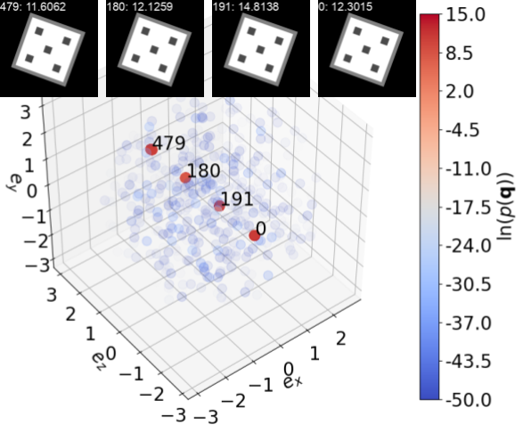
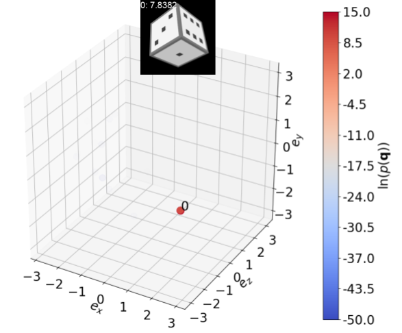
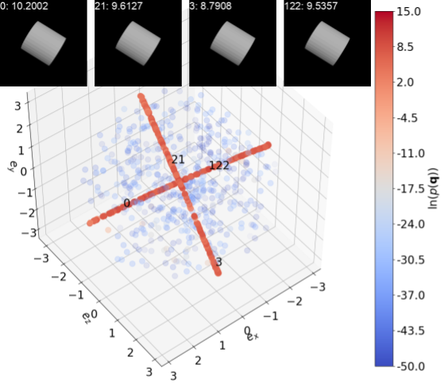
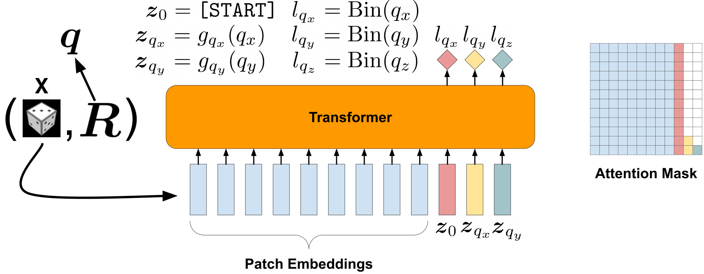
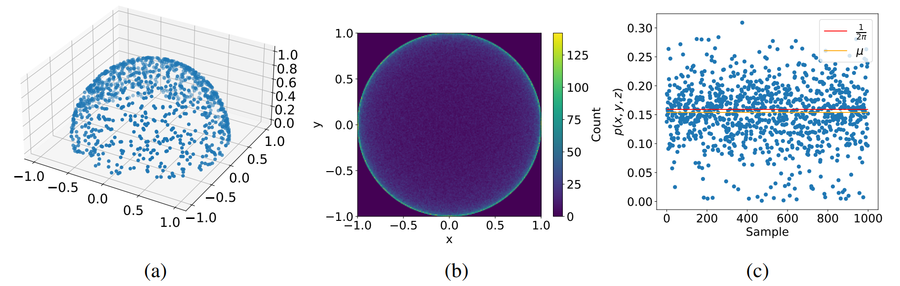
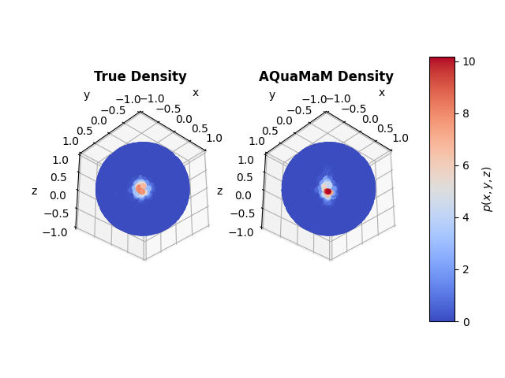
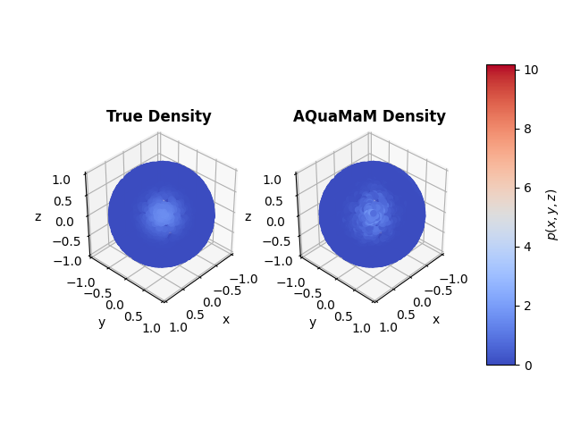

<p align="center">
  
</p>

This is the repository for the paper:

>[Michael A. Alcorn](https://sites.google.com/view/michaelaalcorn). [**AQuaMaM**: An Autoregressive, Quaternion Manifold Model for Rapidly Estimating Complex **SO**(3) Distributions](https://arxiv.org/abs/2301.08838). arXiv. 2023.

|  |  |  |
|:--:|:--:|:--:|

AQuaMaM effectively models the uncertainty of different viewpoints of objects, as demonstrated here for a die and a cylinder (note, separate models were trained for each object).
In the plots, each point corresponds to a [rotation vector](https://en.wikipedia.org/wiki/Axis%E2%80%93angle_representation#Rotation_vector) $\mathbf{\theta} = \theta \mathbf{e}$, i.e., all rotation vectors are contained within a [ball](https://en.wikipedia.org/wiki/Ball_(mathematics)) of radius $\pi$.
Both the color and the transparency of each point are a function of the log density $\ln(p(\mathbf{q}))$ with redder, more opaque points representing more likely rotations and bluer, more transparent points representing less likely rotations.
1,000 rotations are depicted in each plot—one rotation (labeled 0) corresponds to the ground truth, 499 rotations were obtained by sampling from the AQuaMaM distribution, and the remaining 500 rotations were randomly selected from [the uniform distribution on **SO(3)**](https://www.blopig.com/blog/2021/08/uniformly-sampled-3d-rotation-matrices/).
Each image of a die/cylinder corresponds to one of the points in its respective plot.
The number before the colon indicates the associated annotated point, and the number after the colon is the $\ln(p(\mathbf{q}))$ for that pose.
**Left**: Because the five side of the die is facing the camera in the die's default pose, all rotations showing only the five occur along the $(0, 0, 1)$ axis, which is reflected by the locations of the red points in the plot.
Additionally, there are four high probability regions along the axis corresponding to the four rotations that could produce an identical image.
**Middle**: For this unambiguous viewpoint, almost all of the probability is concentrated at the correct rotation, which causes the other points to fade entirely from view (the *maximum* $\ln(p(\mathbf{q}))$ among the random rotations was -74.7).
**Right**: AQuaMaM is also capable of learning distributions for objects with continuous symmetries, as shown here for a viewpoint of the cylinder.
The cylinder's two axes of symmetry are clearly visible as high density curves in the rotation vector ball.

|  |
|:--:|

An overview of the AQuaMaM architecture.
Given an image/rotation matrix pair $(\mathbf{X}, \mathbf{R})$, the image is first converted into a sequence of $P$ patch embeddings while the rotation matrix is converted into its [unit quaternion representation](https://en.wikipedia.org/wiki/Quaternions_and_spatial_rotation) $\mathbf{q} = [q_{x}, q_{y}, q_{z}, q_{w}]$.
By restricting the unit quaternions to those with positive real components (which is allowed because $\mathbf{q}$ and $-\mathbf{q}$ [encode the same rotation](https://marc-b-reynolds.github.io/quaternions/2017/11/10/AveRandomRot.html)), $q_{w}$ becomes fully determined and does not need to be modeled.
Next, each of the first two components $q_{c}$ of $\mathbf{q}$ is mapped to an embedding $z_{q_{c}}$ by a separate subnetwork $g_{q_{c}}$.
The full input to the Transformer is thus a sequence consisting of the $P$ patch embeddings, a special `[START]` embedding $z_{0}$, and the two unit quaternion embeddings. The labels $l_{q_{x}}$, $l_{q_{y}}$, and $l_{q_{z}}$ are generated by assigning $q_{x}$, $q_{y}$, and $q_{z}$ to one of $N$ labels through a binning function $\text{Bin}$.
Using a partially causal attention mask, AQuaMaM models the conditional distribution $p(q_{x}, q_{y}, q_{z} &#124; \mathbf{X})$ *autoregressively*, i.e., $p(q_{x}, q_{y}, q_{z} &#124; \mathbf{X}) = p(q_{x} &#124; \mathbf{X}) p(q_{y} &#124; q_{x}, \mathbf{X}) p(q_{z} &#124; q_{x}, q_{y}, \mathbf{X})$ where each component is modeled as a mixture of uniform distributions that partition the component's geometrically constrained domain.
Because minimizing the loss of a mixture of uniform distributions is equivalent (up to a constant) to minimizing the classification loss over the bins, AQuaMaM is trained as a "quaternion language model".

|  |
|:--:|

Because there is a [bijective mapping](https://en.wikipedia.org/wiki/Bijection) between the unit disk $B^{2} =$ { $\mathbf{u} \in \mathbb{R}^{2}: \lVert \mathbf{u} \rVert < 1$ } and the unit hemisphere $\widetilde{S}^{2} =$ { $\mathbf{v} \in \mathbb{R}^{3}: \lVert \mathbf{v} \rVert = 1, z > 0$ }, the challenging task of estimating a distribution on the curved $\widetilde{S}^{2}$ [manifold](https://en.wikipedia.org/wiki/Manifold) can be simplified to estimating a distribution on the non-curved (i.e., [Euclidean](https://en.wikipedia.org/wiki/Euclidean_space)) $B^{2}$.
(a) Here, the true distribution on $\widetilde{S}^{2}$ is a uniform distribution, i.e., each point has a density of $\frac{1}{2\pi}$ (because $\widetilde{S}^{2}$ has a surface area of $2\pi$).
(b) Points that are uniformly sampled from $\widetilde{S}^{2}$ and then [projected](https://en.wikipedia.org/wiki/Projection_(linear_algebra)) onto $B^{2}$ are more concentrated towards the edges of $B^{2}$ due to the curvature of $\widetilde{S}^{2}$.
If we model the distribution of $(x, y)$ coordinates on $B^{2}$ as a mixture of uniform distributions, we can calculate $p(x, y, z)$ by dividing $p(x, y)$ by the area of the parallelogram defined by the [Jacobian](https://en.wikipedia.org/wiki/Jacobian_matrix_and_determinant) located at $(x, y, z)$ on the hemisphere.
(c) The $p(x, y, z)$ calculated through this procedure are generally quite close to the expected density.
The mean density $\mu$ of the 1,000 points shown in (c) is 0.154 (compared to 0.159 for the true density).
A similar procedure is used by AQuaMaM to obtain the probability of a unit quaternion $p(\mathbf{q})$ while only modeling the first three components of $\mathbf{q}$: $q_{x}$, $q_{y}$, and $q_{z}$.

|  |  |
|:--:|:--:|
| (a) | (b) |

AQuaMaM can model distributions on other kinds of manifolds too.
The left plots in (a) and (b) show the true density on a sphere for a mixture of two [von Mises–Fisher distributions](https://en.wikipedia.org/wiki/Von_Mises%E2%80%93Fisher_distribution) with the viewpoints being centered on the two modes.
The right plots show the density learned by AQuaMaM Jr. (a slight modification of the AQuaMaM architecture; see the Colab notebook [here](https://colab.research.google.com/drive/14ewJABsrOBkFVqjIkUt5xrBBdtNdRa9U?usp=sharing)).

## Citation

If you use this code for your own research, please cite:

```
@article{alcorn2023aquamam,
   title={AQuaMaM: An Autoregressive, Quaternion Manifold Model for Rapidly Estimating Complex SO(3) Distributions},
   author={Alcorn, Michael A.},
   journal={arXiv preprint arXiv:2301.08838},
   year={2023}
}
```

## Training AQuaMaM

### Installing the necessary Python packages

```bash
pip3 install --upgrade -r requirements.txt
```

### Generating the training data

```bash
python3 generate_datasets.py {cube|cylinder}
```

This script renders 520,000 images of the selected object (`cube` or `cylinder`), so it takes a little while to run.
The script creates a directory named `cube` or `cylinder` that contains three CSVs: `metadata_train.csv`, `metadata_valid.csv`, and `metadata_test.csv`, and a folder `images` with three subfolders: `train` (which contains 500,000 images), `valid` (which contains 10,000 images), and `test` (which also contains 10,000 images).

### Running the training script

Run the following script, editing the variables as appropriate. To change the model/training hyperparameters for a run, edit [`configs.py`](configs.py).

```bash
MODEL=aquamam
DATASET=die
nohup python3 train.py ${MODEL} ${DATASET} > ${MODEL}_${DATASET}.log &
```

### Running the evaluation script

Run the following script, editing the variables as appropriate.

```bash
MODEL=aquamam
DATASET=die
python3 evaluate.py ${MODEL} ${DATASET}
```

## Learning a "peak" distribution

Following "[Delving into Discrete Normalizing Flows on SO(3) Manifold for Probabilistic Rotation Modeling](https://pku-epic.github.io/RotationNormFlow/)", I trained AQuaMaM on a "peak" distribution(Colab notebook [here](https://colab.research.google.com/drive/1cGOBfaUR2bxfJLefo_oQSlb_5Gfu5nj8?usp=sharing)).
On this distribution, the discrete normalizing flow model reached a log-likelihood of 13.93 with the next closest baseline model reaching 13.47 (see Table 1 in their paper).
In comparison, AQuaMaM reached a log-likelihood of 29.51.
This performance is a direct consequence of AQuaMaM's formulation, and is discussed in Section 2.4 of the manuscript:

>As a final point, it is worth noting that the last term in Equation 4 is bounded below such that $`\frac{N q_{w}}{2 ω_{q_{y}} ω_{q_{z}}} \geq \frac{N^{3} q_{w}}{8}`$, i.e., for a given $`π_{q_{x}} π_{q_{y}} π_{q_{z}}`$, the likelihood increases *at least* cubically with the number of bins.
>For 50,257 bins (i.e., the size of GPT-2/3's vocabulary), $`N^{3} = 1.26 \times 10^{14}`$.
